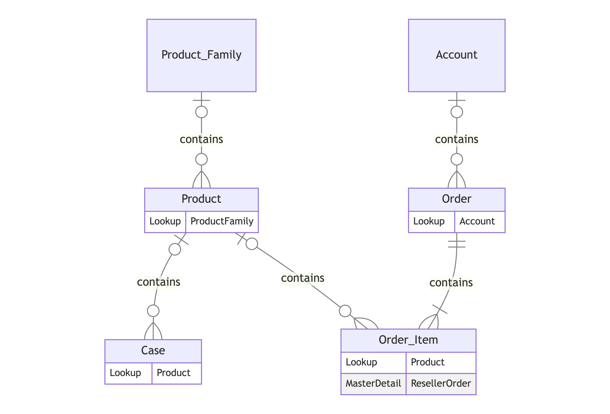

# Salesforce Object ERD Converter

A script to convert Salesforce objects and fields into an Entity-Relationship Diagram (ERD) using Mermaid.

Here the ERD for the [eBikes sample app](https://github.com/trailheadapps/ebikes-lwc):


## Installation

You will need Python to run this script. Install the required packages using the following command:

```bash
pip3 install xml.etree.ElementTree zipfile os sys
```

## Usage

Exporting Salesforce Objects and Fields with [sfdx cli](https://developer.salesforce.com/docs/atlas.en-us.sfdx_setup.meta/sfdx_setup/sfdx_setup_intro.htm).

Once you've exported the Salesforce objects and fields, use the script by running the following command:

```bash
python3 convert_to_erd.py path_to_zip_or_folder [keep_all_fields]
```

- `path_to_zip_or_folder`: The path to the zip file or folder containing the XML files.
- `keep_all_fields`: (Optional) Set to `true` if you want to keep all fields.

## Output

The script generates a Mermaid ER diagram and saves it in a text file.

### Viewing the Mermaid Diagram

To view the generated Mermaid ER diagram, you can use an online Mermaid live editor. Here's how you can do it:

#### Online Mermaid Live Editor:

1. Open [Mermaid Live Editor](https://mermaid-js.github.io/mermaid-live-editor/).
2. Copy the generated Mermaid code from the text file.
3. Paste it into the editor to view the diagram.

## License

This project is licensed under the MIT License.
